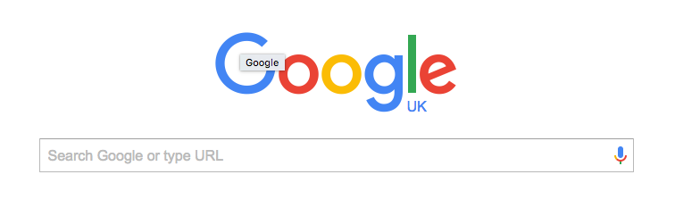

# README

##Ryan Chapman Portfolio

This is the **README** file for Ryan Chapman's online portfolio.

###Getting Set Up

You can use the following command to clone the website.  

HTML Link:

```bash
	https://github.com/RyanSpartan117/onlinePortfolio.git	
```

SSH Link:

```bash
	git@github.com:RyanSpartan117/onlinePortfolio.git
```

## Project Examples

I was the proud engineer behind [Google](www.google.com).  
It's *pretty* good, if i do say so myself.

  

Please feel free to send donations to <rchapman@spartaglobal.co>. Or send your appreciation to:  

>P.O BOX  
>123 HeyEnd  
>SE25 5TR


**Things you can send me**  

- Complete works of Vincent Van Gogh
- Mouse traps
- String
* Money
* More Money
* Honestly, i'm poor