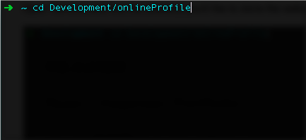
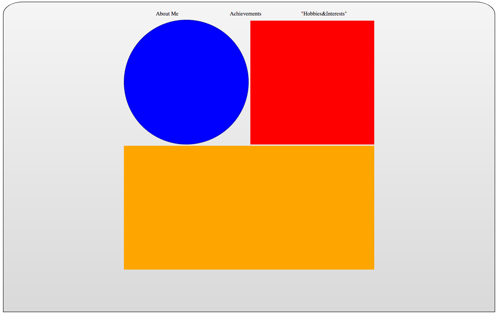
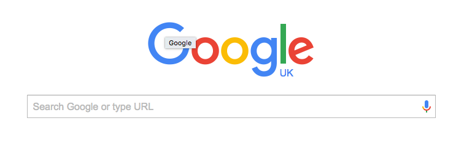

# README

##Ryan Chapman Portfolio

This is the **README** file for Ryan Chapman's online portfolio.

###Getting Set Up

Make sure the directory you're in is *not* already a git repository.

Open Terminal and find the directory you'd like to clone the website into using cd and the pathname:




Then, from there, you can use the following command to clone the website. 


SSH Link:

```bash
	git clone git@github.com:RyanSpartan117/onlinePortfolio.git
``` 

Here is the direct link to the Repository:

HTML Link:

```bash
	https://github.com/RyanSpartan117/onlinePortfolio.git	
```


## Technologies Used

The website has been made using a mix of HTML and CSS, with JavaScript functions on the horizon.  

Currently, the website is in the layout phase, with most focus going on the Navigation Bar functionality.



As you can see, it's beautiful.

###Future Website Endeavours and Thought Process

For now, i'm not worried about website content. The inital iteration for the website is a visual representation of how i **might** lay the profile out.  

The dimensions of the containers help me visualise where there may be too much space, or not enough.

The "End Goal" is a sleek, minimalistic website with a snapshot of credentials and useful information on myself on the home page with options to look further.  

I'll probably change my mind next week, though.


<!--
I was the proud engineer behind [Google](www.google.com).  
It's *pretty* good, if i do say so myself.

  

Please feel free to send donations to <rchapman@spartaglobal.co>. Or send your appreciation to:  

>P.O BOX  
>123 HeyEnd  
>SE25 5TR


**Things you can send me**  

- Complete works of Vincent Van Gogh
- Mouse traps
- String
* Money
* More Money
* Honestly, i'm poor-->